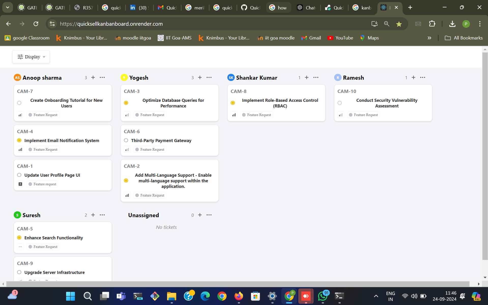
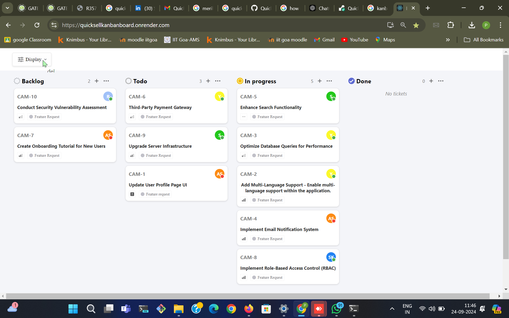
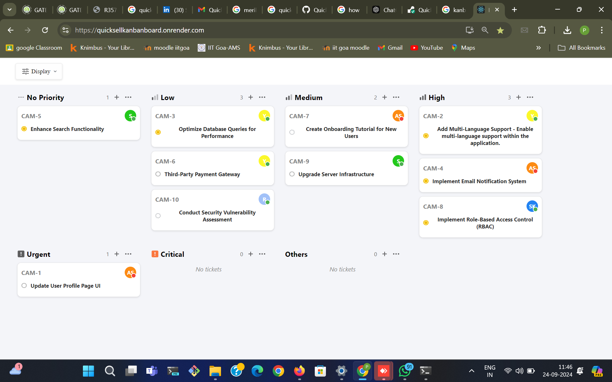

# Kanban Board Assessment - [Quick Sell]

## Overview
The goal of this project is to develop an interactive Kanban board application using **React JS** that interacts with the provided API. The Kanban board allows users to group tickets in three distinct ways, sort them, and dynamically adjust the board based on user input.

### API Link: 
[QuickSell API](https://api.quicksell.co/v1/internal/frontend-assignment)

### Live Application Link:
[Kanban Board Live Demo](https://quicksellkanbanboard.onrender.com/)

---

## Requirements:

### Features:
- **Dynamic Grouping:** The application should allow the user to group tickets in three distinct ways:
  1. By **Priority**
  2. By **Status**
  3. By **Assignee**

- **Dynamic Sorting:** Users should be able to sort the displayed tickets in two ways:
  1. By **Title**
  2. By **Groups** (Priority, Status, or Assignee)

- **User Interaction:** A "Display" button should allow users to select a grouping option. The Kanban board should update dynamically based on the selected grouping and sorting criteria.

- **API Interaction:** The application should fetch and display ticket data from the provided API.

### Evaluation Criteria:
1. **UI Accuracy:** The UI must look exactly like the provided screenshots.
2. **Functionality:** Group and sort tickets dynamically based on user interaction.
3. **API Integration:** Correct interaction with the provided API to retrieve and display the data.

---

## Project Setup:
1. **React**
2. **CSS**
3. **HTML**

## Images of Website
### Grouping based on User

### Grouping based on Status

### Grouping based on Priority


### Installation Steps:
1. Clone the repository:
   ```bash
   git clone <repository-url>
